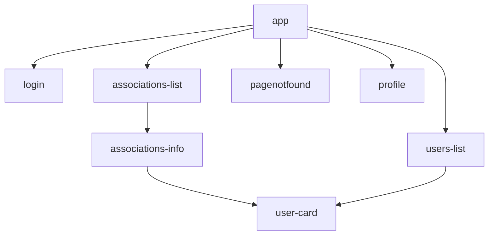

# Components

Arriving at the app you need to log in or register via the login form. Next, you can navigate between the associations list and users list. These list enable access to the detail of a user or an association.

If the page you request is not available, then you will be redirected to the `pagenofound` module.

# External dependencies
- [Tailwind CSS](https://tailwindcss.com/) for nice in-HTML styles with classes
- [DaisyUI](https://daisyui.com/) for nice components, like inputs and modals.

# Inputs
All the inputs are in forms that uses `FormGroup`. In this way, we can get all the values of a form by querying it on only one object that is always up-to-date. 

This allows forms to have the property `(ngSubmit)`, so that the request is sent if either the submit button is pressed, or the enter key is pressed on any of the fields.

# Login
The login module is defined in `interceptors` module. If a backend request failed and return a `404` error, then we have to reconnect the user.

# Lists
Associations and users list uses tables with buttons on each line.
