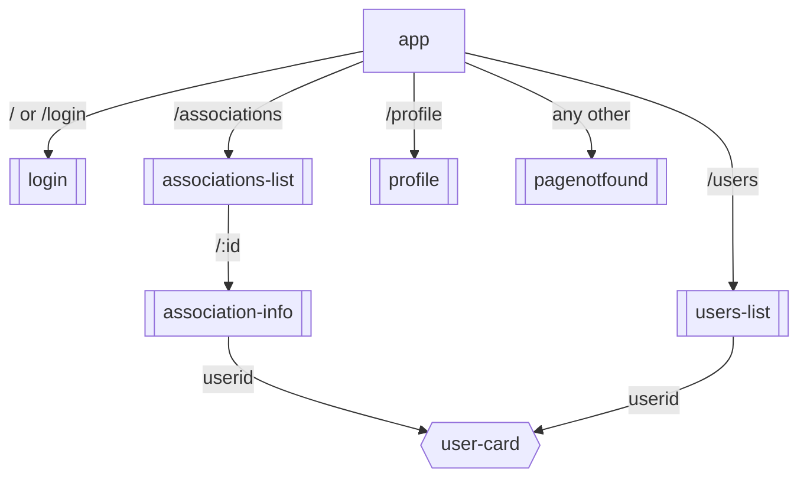
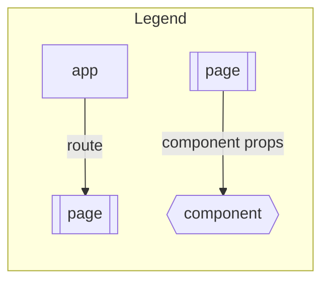

# Description

The front-end is an Angular application. It is built with Angular 14.2.0.

While landing on the app, you will be asked need to log in or register via the login form. Next, you can navigate between the associations list and users list using a pleasant user friendly interface. 

The associations list is a list of all the associations. You can click on an association to see its details. You can also create a new association or delete an existing one.

The users list is a list of all the users. You can click on a user to see his details. You can also delete an existing user.

You can also access your profile by clicking on your name in the top right corner. You can edit your personal information and change your password.

Finally you can log out by clicking on the logout button in the top right corner.

If the page you request is not available, then you will be redirected to the `pagenofound` module.

## Features 

For the features list, check the [README](../README.md).

# Modules structure

<!-- generate the route table  -->
| Route             | Module            |
| ----------------- | ----------------- |
| /                 | login             |
| /login            | login             |
| /associations     | associations-list |
| /users            | users-list        |
| /profile          | profile           |
| /associations/:id | association-info  |
| /:any_other     | pagenotfound      |

# External dependencies

- [Tailwind CSS](https://tailwindcss.com/) for nicer inline-HTML styling experience.
- [DaisyUI](https://daisyui.com/) component librairy, (e.g.: input, button, layout and modal).

# Input logic

All the inputs are in forms that use `FormGroup`. In this way, we can get all the values of a form by querying it on only one object that is always up-to-date. 

This allows forms to have the property `(ngSubmit)`, so that the request is sent if either the submit button is pressed, or the enter key is pressed on any of the fields.

# Auth

The application uses a JWT token to authenticate the user. The token is stored in the local storage.

Each request to the API is intercepted by the `interceptors` module. If the token is missing or expired, then the user will be redirected to the login page.