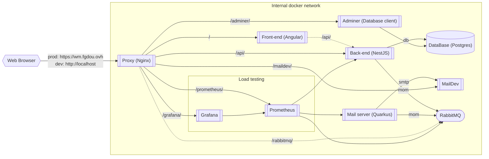

# Services architecture

The dots links are specials links, not useful to actually run the services :
- The front / back link do not really exist. The front on the web-browser call the `/api` location and is redirected through `nginx` directly on the backend.
- The rabbitMQ link exist, but is only here to connect to the management plugin of RabbitMQ. It is not used by any services, just by the user for debug.

| Name              | Technologies         | Docker Hostname | Url Production                    | Url Dev                           | Source code                                             |
|-------------------|----------------------|-----------------|-----------------------------------|-----------------------------------|---------------------------------------------------------|
| Nginx             | Nginx                | `proxy`         | https://wm.fgdou.ovh/             | http://localhost/                 | [/nginx](../nginx/)                                     |
| Front             | Angular, TS          | `front`         | https://wm.fgdou.ovh/             | http://localhost/                 | [/fr-administration-front](../fr-administration-front/) |
| API               | NestJS, TS           | `back`          | https://wm.fgdou.ovh/api/         | http://localhost/api/             | [/fr-administration](../fr-administration/)             |
| Swagger           | Swagger              | `back`          | https://wm.fgdou.ovh/api/api      | http://localhost/api/api/         | [/fr-administration](../fr-administration/)             |
| Mail microservice | Quarkus native, Java | `mail`          | *not accessible from the outside* | *not accessible from the outside* | [/mail](../mail/)                                       |
| MailDev           | MailDev              | `smtp`          | https://wm.fgdou.ovh/maildev/     | http://localhost/maildev/         | *docker image*                                          |
| RabbitMQ          | RabbitMQ             | `mom`           | https://wm.fgdou.ovh/rabbitmq/    | http://localhost/rabbitmq/        | [/rabbitmq](../rabbitmq/)                               |
| Adminer (dev)     | Adminer              | `adminer`       | *not accessible from the outside* | http://localhost/adminer/         | *docker image*                                          |
| Database          | Postgres             | `db`            | *not accessible from the outside* | *not accessible from the outside* | *docker image*                                          |
| Grafana           | Grafana              | `grafana`       | https://wm.fgdou.ovh/grafana/     | http://localhost/grafana/         | *docker image*                                          |
| Database          | Prometheus           | `prometheus`    | https://wm.fgdou.ovh/prometheus/  | http://localhost/prometheus/      | *docker image*                                          |

> Note: Usernames and passwords for rabbitmq and postgres are in the [.env](../.env) file.