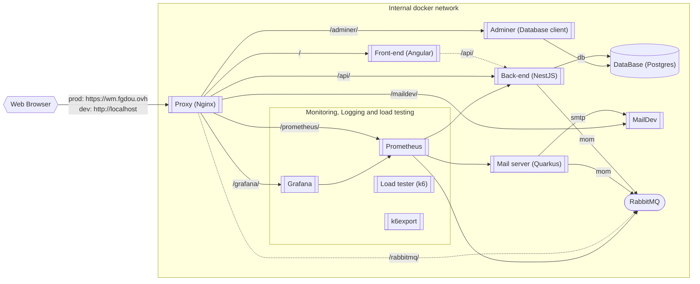

- [Services](#services)
- [Services Architecture](#services-architecture)
- [Choice of technologies](#choice-of-technologies)
  - [Nginx](#nginx)
  - [Frontend](#frontend)
  - [Backend REST API](#backend-rest-api)
  - [Swagger API](#swagger-api)
  - [RabbitMQ](#rabbitmq)
  - [Quarkus](#quarkus)
  - [MailDev](#maildev)
  - [Admider](#admider)
  - [Prometheus](#prometheus)
  - [Grafana](#grafana)
  - [K6](#k6)
  - [Postgres](#postgres)
- [Configuration](#configuration)

# Services

| Name          | Technologies         | Docker Hostname | Url Production                    | Url Dev                           | Source code                                             | Load tested | Monitored | Logged |
| ------------- | -------------------- | --------------- | --------------------------------- | --------------------------------- | ------------------------------------------------------- | :---------: | :-------: | :----: |
| Nginx         | Nginx                | `proxy`         | https://wm.fgdou.ovh/             | http://localhost/                 | [/nginx](../nginx/)                                     |             |           |        |
| Front         | Angular, TS          | `front`         | https://wm.fgdou.ovh/             | http://localhost/                 | [/fr-administration-front](../fr-administration-front/) |             |           |        |
| API           | NestJS, TS           | `back`          | https://wm.fgdou.ovh/api/         | http://localhost/api/             | [/fr-administration](../fr-administration/)             |      ✅      |     ✅     |        |
| Swagger       | Swagger              | `back`          | https://wm.fgdou.ovh/api/api      | http://localhost/api/api/         | [/fr-administration](../fr-administration/)             |      ✅      |     ✅     |        |
| Mailing       | Quarkus native, Java | `mail`          | *not accessible from the outside* | *not accessible from the outside* | [/mail](../mail/)                                       |             |     ✅     |        |
| MailDev       | MailDev              | `smtp`          | https://wm.fgdou.ovh/maildev/     | http://localhost/maildev/         | *docker image*                                          |             |           |        |
| RabbitMQ      | RabbitMQ             | `mom`           | https://wm.fgdou.ovh/rabbitmq/    | http://localhost/rabbitmq/        | [/rabbitmq](../rabbitmq/)                               |             |     ✅     |        |
| Adminer (dev) | Adminer              | `adminer`       | *not accessible from the outside* | http://localhost/adminer/         | *docker image*                                          |             |           |        |
| Database      | Postgres             | `db`            | *not accessible from the outside* | *not accessible from the outside* | *docker image*                                          |             |           |        |
| Monitoring UI | Grafana              | `grafana`       | https://wm.fgdou.ovh/grafana/     | http://localhost/grafana/         | *docker image*                                          |             |           |        |
| Monitoring    | Prometheus           | `prometheus`    | https://wm.fgdou.ovh/prometheus/  | http://localhost/prometheus/      | *docker image*                                          |             |           |        |

> Note: Usernames and passwords for rabbitmq and postgres are in the [.env](../.env) file.

# Services Architecture

The doted links are specials links, not useful to actually run the services :
- The `front / back` link do not really exist. The front on the web-browser call the `/api` location and is redirected through `nginx` directly on the backend.
- The `rabbitMQ` link exist, but is only here to connect to the management plugin of RabbitMQ. It is not used by any services, just by the user for debug.

> Note: Usernames and passwords for rabbitmq and postgres are in the [.env](../.env) file.

# Choice of technologies

## Nginx

Used as a reverse proxy to redirect the requests to the right service. It also serves the static files of the front-end. We chosed Nginx because it is very **easy to configure** and is **widely used** in the industry.

## Frontend

Angular was **chosen by the client**, so we had to use it. Nevertheless, there are plenty of frontend frameworks that could have been used. (e.g.: React, Vue, Svelte, etc.)

## Backend REST API

For the API we used NestJS using TypeScript. This was also **chosen by the client**. NestJS is **widely used** in the industry and is a **good framework** to use.

## Swagger API

Swagger API is a developping tool to show the API documentation. It was **chosen by the client**.

## RabbitMQ

Used to send messages between the backend and the mail microservice with a queue system. We chose RabbitMQ because it is a very **popular** message broker. Other popular message brokers are Kafka and ActiveMQ.

## Quarkus

This is the mail api which send mail to the maildev service. 
At the production build, GraalVM is used to compile in native mode.
The build does not require GraalVM or Quarkus, since it use docker for the build.

We chose Quarkus because it is a very popular Java framework and it is very **easy to use**. It is also **very fast** and **lightweight** due to its **native compilation**. The side effect of the native compilation is that it is **very slow to compile**.

## MailDev

Used to **debug** the emails sent by the mail microservice. It is a **very simple** and **lightweight** SMTP server that displays the emails sent to it.

## Admider

Adminer is a development tool to **manage** the database. It is a **lightweight** and **easy to setup** with preconfigured docker image.

## Prometheus

Prometheus is the center of the monitoring system. Prometheus plug into the services to collect metrics and store them in a database (Pull and Store). Other alternatives are InfluxDB (Push to Store), Graphgite or Kapacitor. It was **recommended by the client**.

## Grafana

This is the interface to display the metrics stored by Prometheus. It is a **very popular** and quite **modern** with a **pleasant interface** that is **easy to customize**.

## K6

K6 is a tool to operate load testing on our REST API. We run **4 types of test**s : smoke test, load test, soak test and stress test. K6 as the advantage of being very **modern** and **frictionless** to use. The setup of the routes and the tests are configured using **Javascript** which we are confortable with. To send the metrics of the load test to Prometheus we used a middleware which is Statsd. 

We could use other tools like [wrk](https://github.com/wg/wrk) and [locust](https://github.com/locustio/locust) wich are also widely used

## Postgres

Postgres is the database used by the backend. We firstly attempted to MySQL and SQLite which lead numerous **compatibility issues**. We then switched to Postgres which made everything **simpler**.

# Configuration

You can configure the services with environment variables available in the [.env](../.env) file.

It's not recommanded to change the default values, but if you want to, you can.

| Service  | Variable Name  | Description             | Default value          |
| -------- | -------------- | ----------------------- | ---------------------- |
| Database | `DB_USERNAME`  | Database login username | `user`                 |
| Database | `DB_PASSWORD`  | Database login password | `esir`                 |
| Database | `HOST`         | Database hostname       | `localhost`            |
| Database | `DB_DATABASE`  | Database name           | `WMproject`            |
| Front    | `FRONT_PORT`   | Front port              | `80`                   |
| Front    | `BACK_URL`     | Back url                | `http://localhost/api` |
| Front    | `FRONT_URL`    | Front url               | `http://localhost`     |
| Back     | `BACK_PORT`    | Back port               | `3000`                 |
| RabbitMQ | `RABBIT_USER`  | RabbitMQ login username | `user`                 |
| RabbitMQ | `RABBIT_PWD`   | RabbitMQ login password | `password`             |
| Grafana  | `GRAFANA_USER` | Grafana login username  | `user`                 |
| Grafana  | `GRAFANA_PWD`  | Grafana login password  | `password`             |
