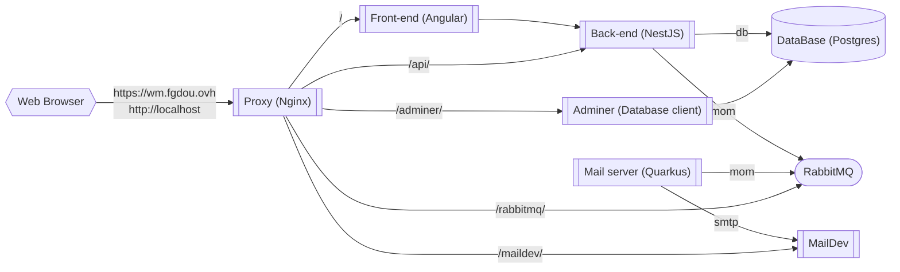

# Diagram of the services

| Name              | Technology     | Docker Hostname | Url Production                 | Url Dev                    | Source code                                            |
|-------------------|----------------|-----------------|--------------------------------|----------------------------|--------------------------------------------------------|
| Front             | Angular        | front           | https://wm.fgdou.ovh/          | http://localhost/          | [fr-administration-front](../fr-administration-front/) |
| API               | NestJS         | back            | https://wm.fgdou.ovh/api/      | http://localhost/api/      | [fr-administration](../fr-administration/)             |
| Swagger           | Swagger        | back            | https://wm.fgdou.ovh/api/api   | http://localhost/api/api/  | [fr-administration](../fr-administration/)             |
| Mail microservice | Quarkus native | mail            |                                |                            | [mail](../mail/)                                       |
| MailDev           | MailDev        | smtp            | https://wm.fgdou.ovh/maildev/  | http://localhost/maildev/  |                                                        |
| RabbitMQ          | RabbitMQ       | mom             | https://wm.fgdou.ovh/rabbitmq/ | http://localhost/rabbitmq/ |                                                        |
| Adminer (dev)     | Adminer        | adminer         |                                | http://localhost/adminer/  |                                                        |
| Database          | postgres       | db              |                                |                            |                                                        |
| Nginx             | Nginx          | proxy           |                                |                            | [nginx](../nginx/)                                     |

Usernames and passwords for rabbitmq and postgres are in the [.env](../.env) file.